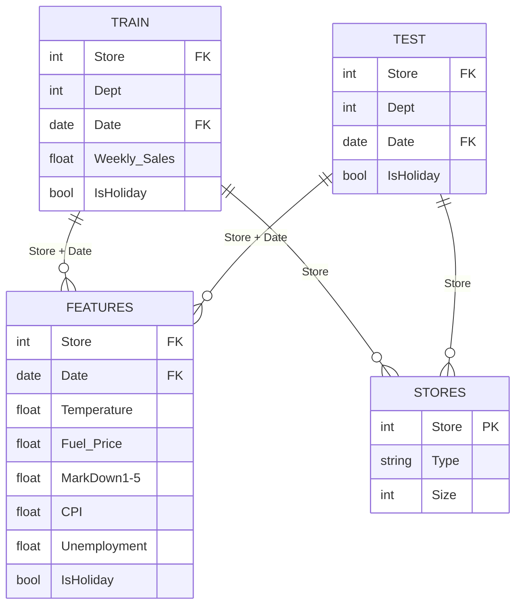

# AI-Powered Retail Sales Analytics and Sales Prediction — Implementation Plan

## 1. Project Overview

### Problem Statement
Retail businesses need accurate weekly sales forecasts to optimize inventory, staffing, and promotional strategies. This project builds an **AI-Powered Retail Sales Analytics and Prediction System** using Walmart's historical store sales data across 45 stores and 81 departments.

### Why Retail Sales Prediction Matters
- **Inventory optimization**: Reduces overstock/stockout costs
- **Staffing decisions**: Aligns labor with expected demand
- **Promotional planning**: Quantifies holiday/markdown impact
- **Financial forecasting**: Enables accurate revenue projections

### How Data Analytics + AI/ML Are Combined
1. **Data Analytics**: EDA reveals patterns (seasonal trends, store/department performance, holiday effects, external factor correlations)
2. **AI/ML**: Regression models learn these patterns and generate weekly sales predictions
3. **Dashboard**: Makes insights and predictions accessible to business stakeholders

---

## 2. Dataset Understanding

### File Summary

| File | Rows | Columns | Description |
|------|------|---------|-------------|
| `train.csv` | 421,570 | 5 | Historical weekly sales per store-department |
| `test.csv` | 115,064 | 4 | Future weeks needing predictions (no `Weekly_Sales`) |
| `features.csv` | 8,190 | 12 | Store-level weekly features (economic + markdowns) |
| `stores.csv` | 45 | 3 | Store metadata (type + size) |
| `sampleSubmission.csv` | 115,064 | 2 | Kaggle submission format (`Id`, `Weekly_Sales`) |

### Detailed Column Inventory

#### train.csv (421,570 × 5)
| Column | Type | Nulls | Notes |
|--------|------|-------|-------|
| Store | int64 | 0 | 1–45 (45 stores) |
| Dept | int64 | 0 | 1–99 (81 unique departments) |
| Date | string | 0 | `2010-02-05` to `2012-10-26` (143 weeks) |
| Weekly_Sales | float64 | 0 | Target. Range: -$4,988.94 to $693,099.36 |
| IsHoliday | bool | 0 | False=391,909, True=29,661 |

#### test.csv (115,064 × 4)
| Column | Type | Nulls | Notes |
|--------|------|-------|-------|
| Store | int64 | 0 | Same 45 stores |
| Dept | int64 | 0 | Same 81 departments |
| Date | string | 0 | `2012-11-02` to `2013-07-26` (39 weeks) |
| IsHoliday | bool | 0 | — |

#### features.csv (8,190 × 12)
| Column | Type | Nulls | Null % | Notes |
|--------|------|-------|--------|-------|
| Store | int64 | 0 | 0% | — |
| Date | string | 0 | 0% | `2010-02-05` to `2013-07-26` |
| Temperature | float64 | 0 | 0% | — |
| Fuel_Price | float64 | 0 | 0% | — |
| MarkDown1 | float64 | 4,158 | 50.8% | Promotional markdowns |
| MarkDown2 | float64 | 5,269 | 64.3% | Promotional markdowns |
| MarkDown3 | float64 | 4,577 | 55.9% | Promotional markdowns |
| MarkDown4 | float64 | 4,726 | 57.7% | Promotional markdowns |
| MarkDown5 | float64 | 4,140 | 50.5% | Promotional markdowns |
| CPI | float64 | 585 | 7.1% | Consumer Price Index |
| Unemployment | float64 | 585 | 7.1% | — |
| IsHoliday | bool | 0 | 0% | — |

#### stores.csv (45 × 3)
| Column | Type | Nulls | Notes |
|--------|------|-------|-------|
| Store | int64 | 0 | 1–45 |
| Type | string | 0 | A=22, B=17, C=6 |
| Size | int64 | 0 | 34,875 to 219,622 sq ft |

### Target Variable
**`Weekly_Sales`** (float64) — weekly sales in dollars per store-department.

### Key Observations
- **1,285 negative sales values** exist (likely returns/adjustments) — these are valid business data and should NOT be removed
- **73 zero sales values** — valid (some departments may have no sales certain weeks)
- **No duplicate rows** in any file
- **No missing values** in train.csv, test.csv, or stores.csv
- **Significant missing values** in features.csv: MarkDown columns (50–64%), CPI and Unemployment (7.1%)
- **Train and test date ranges do not overlap** — train ends `2012-10-26`, test starts `2012-11-02` (natural time split)
- **All 45 stores and 81 departments** are present in both train and test

### Data Relationships



- **train/test → features**: Merge on `(Store, Date)` — features is at store-week level (one row per store per week). After merging with train (which has multiple departments per store-week), the merged dataset retains 421,570 rows. `IsHoliday` is consistent between train and features (0 mismatches verified).
- **train/test → stores**: Merge on `Store` — one-to-many (each store maps to many train/test rows).
- **Merge order**: `train/test` → JOIN `features` ON `(Store, Date, IsHoliday)` → JOIN `stores` ON `(Store)`

---

## 3. Data Engineering Plan

### 3.1 Merging Strategy
```
train + features  →  merge on (Store, Date, IsHoliday)  →  421,570 rows
      + stores    →  merge on (Store)                    →  421,570 rows (final)
```
Same merge logic for test data.

### 3.2 Date Conversion
- Parse `Date` to `datetime64` type
- Extract temporal features (see Feature Engineering)

### 3.3 Missing Value Handling

| Column | Strategy | Rationale |
|--------|----------|-----------|
| MarkDown1–5 | Fill with **0** | Markdowns are promotional; missing = no promotion active |
| CPI | **Forward-fill** within each store, then **backward-fill** | CPI changes slowly; temporal interpolation is appropriate |
| Unemployment | **Forward-fill** within each store, then **backward-fill** | Unemployment changes slowly; same rationale |

### 3.4 Duplicate Handling
- No duplicates found in any file. After merging, will verify no duplicates are introduced.

### 3.5 Categorical Encoding
- **Store Type** (A/B/C): One-hot encode or ordinal encode (A=large, B=medium, C=small based on size correlation)
- **IsHoliday**: Already boolean → convert to int (0/1)
- **Store** and **Dept**: Will be used as integer features (tree models handle this well); for Linear Regression, may need encoding strategy

### 3.6 Numerical Processing
- **StandardScaler** for Linear Regression (required for convergence)
- Tree-based models (Random Forest, Gradient Boosting) do not require scaling
- Preprocessing pipeline will conditionally apply scaling

### 3.7 Outlier Handling
- **Negative sales** (1,285 rows): Keep — these represent valid returns/adjustments
- **Zero sales** (73 rows): Keep — valid business scenario
- **Extreme positive sales** (max $693K): Keep — likely holiday spikes (e.g., Black Friday). Removing them would bias the model.
- **No blanket outlier removal** — outliers in retail data are often the most important data points (holidays, promotions)

---

## 4. Exploratory Data Analysis Plan

### Sales Analysis
- Distribution of Weekly_Sales (histogram + box plot)
- Summary statistics (total, mean, median, std, min, max)
- Proportion of negative/zero sales

### Time-Series Analysis
- Weekly sales trend over the full date range
- Monthly aggregated sales trends
- Yearly comparison (2010 vs 2011 vs 2012)
- Seasonal decomposition / patterns
- Week-of-year patterns

### Store Analysis
- Total/average sales by store
- Top 10 / Bottom 10 performing stores
- Sales distribution by store type (A vs B vs C)
- Sales vs store size relationship

### Department Analysis
- Total/average sales by department
- Top 10 / Bottom 10 performing departments
- Department sales variability

### Holiday Analysis
- Holiday vs non-holiday average sales comparison
- Impact of specific holidays (Super Bowl, Labor Day, Thanksgiving, Christmas)
- Holiday dates identification from the data

### External Factor Analysis
- Sales vs Temperature (scatter + correlation)
- Sales vs Fuel Price
- Sales vs CPI
- Sales vs Unemployment
- Sales vs Markdown values (for weeks where markdowns exist)
- Correlation heatmap of all numerical features

### Visualizations Created
All figures saved to `outputs/figures/` with clear titles, axis labels, and legends.

---

## 5. Feature Engineering Plan

### Temporal Features (from Date)
| Feature | Source | Rationale |
|---------|--------|-----------|
| Year | Date | Captures year-over-year growth/decline |
| Month | Date | Captures monthly seasonality |
| Week | Date | Captures weekly patterns |
| DayOfWeek | Date | Day-of-week effect |
| Quarter | Date | Quarterly business cycles |
| WeekOfYear | Date | Seasonal patterns within a year |
| IsMonthStart | Date | Start-of-month spending patterns |
| IsMonthEnd | Date | End-of-month patterns |

### Derived Features
| Feature | Source | Rationale |
|---------|--------|-----------|
| TotalMarkDown | Sum of MarkDown1–5 | Overall promotional intensity |
| HasMarkDown | TotalMarkDown > 0 | Binary: any promotion active |
| Type_encoded | Store Type | Ordinal or one-hot encoded |

### Data Leakage Prevention
> [!IMPORTANT]
> - No aggregated future sales data used as features
> - No target encoding using validation period statistics
> - Feature engineering uses only information available at prediction time
> - Time-based validation ensures future data never leaks into training

---

## 6. Machine Learning Strategy

### Baseline
- **Naive Mean Baseline**: Predict the mean Weekly_Sales for each (Store, Dept) combination from the training period. This gives a meaningful baseline since sales vary dramatically across store-department pairs.

### Model 1: Linear Regression
- Simple, interpretable baseline ML model
- Requires feature scaling
- Provides coefficients for interpretability
- Expected limitation: May not capture non-linear interactions

### Model 2: Random Forest Regressor
- Handles non-linear relationships
- Robust to outliers and varying scales
- Built-in feature importance
- Hyperparameters: `n_estimators=100`, `max_depth=15`, `min_samples_leaf=5`, `random_state=42`

### Model 3: Gradient Boosting (sklearn's GradientBoostingRegressor or HistGradientBoostingRegressor)
- Often achieves best performance on tabular data
- Handles missing values natively (HistGradientBoosting)
- Sequential learning corrects errors from previous iterations
- Hyperparameters: `n_estimators=200`, `max_depth=6`, `learning_rate=0.1`, `random_state=42`

> [!NOTE]
> XGBoost is **not installed**. We will use sklearn's `HistGradientBoostingRegressor` which handles missing values natively and is comparable in performance. If you'd like XGBoost installed instead, let me know.

---

## 7. Time-Aware Validation Strategy

### Why Time-Based Validation?
Sales forecasting is inherently a temporal prediction problem. Random splitting would:
- Allow the model to "cheat" by learning from future data points
- Produce over-optimistic validation metrics
- Not reflect real-world forecasting performance

### Split Design
```
Training Period:   2010-02-05  to  2012-06-29  (~126 weeks)
Validation Period: 2012-06-30  to  2012-10-26  (~17 weeks, last ~12% of data)
```

This mimics the actual test scenario: predicting future sales from historical data. The validation period roughly matches the test period length (39 weeks vs ~17 weeks).

> [!NOTE]
> The exact split date will be chosen so that ~85% of data is training and ~15% is validation, with the cut at a clean date boundary.

---

## 8. Evaluation Metrics

| Metric | Formula | Interpretation |
|--------|---------|----------------|
| **MAE** | Mean Absolute Error | Average dollar error per prediction |
| **RMSE** | Root Mean Squared Error | Penalizes large errors more heavily |
| **R²** | Coefficient of Determination | Proportion of variance explained |
| **MAPE** | Mean Absolute Percentage Error | Percentage error (exclude zero/near-zero actuals) |

### MAPE Handling
- Exclude rows where `|actual| < 100` to avoid division by near-zero values inflating MAPE
- Report the count of excluded rows for transparency

### Model Comparison Table
```
Model                  | MAE      | RMSE     | R²    | MAPE
-----------------------|----------|----------|-------|------
Naive Mean Baseline    | ...      | ...      | ...   | ...
Linear Regression      | ...      | ...      | ...   | ...
Random Forest          | ...      | ...      | ...   | ...
Gradient Boosting      | ...      | ...      | ...   | ...
```

### Selection Criteria
- Primary: **RMSE** (penalizes large errors, which matter most in retail — a $50K error is much worse than five $10K errors)
- Secondary: **R²** (overall explained variance) and **MAE** (interpretable average error)
- The final model will be selected based on actual computed metrics, not assumptions

---

## 9. Model Selection

- Compare all models on the time-based validation set
- Select the model with the best **RMSE** as the primary criterion
- Document why the model was selected, its advantages, and limitations
- **No pre-assumed winner** — selection is data-driven

---

## 10. Final Training & Saving

After model selection:
1. Retrain the final model on all available training data (`train.csv` full period)
2. Save the trained model using `joblib` → `models/final_model.joblib`
3. Save feature column names → `models/feature_columns.joblib`
4. Save any fitted preprocessing objects (scaler if used) → `models/preprocessor.joblib`

---

## Proposed Project Structure

```
walmart-recruiting-store-sales-forecasting/
│
├── train.csv                    # Original data (NOT moved/duplicated)
├── test.csv
├── features.csv
├── stores.csv
├── sampleSubmission.csv
│
├── src/
│   ├── __init__.py
│   ├── config.py                # Paths, constants, hyperparameters
│   ├── data_preprocessing.py    # Load, merge, clean, encode
│   ├── feature_engineering.py   # Create temporal + derived features
│   ├── train.py                 # Train multiple models
│   ├── evaluate.py              # Compute metrics, compare models
│   └── predict.py               # Load model, preprocess input, predict
│
├── models/
│   ├── final_model.joblib
│   ├── feature_columns.joblib
│   └── preprocessor.joblib
│
├── outputs/
│   ├── figures/                 # EDA and model visualizations
│   ├── metrics/
│   │   └── model_comparison.csv
│   └── predictions/
│       └── test_predictions.csv
│
├── app/
│   └── app.py                   # Streamlit dashboard
│
├── tests/
│   └── test_pipeline.py         # Basic pipeline tests
│
├── IMPLEMENTATION_PLAN.md
├── README.md
├── requirements.txt
└── .gitignore
```

> [!IMPORTANT]
> The original CSV files will remain in the project root and be referenced via relative paths from `src/config.py`. They will **NOT** be duplicated into a `data/` subfolder.

---

## Proposed Changes

### Configuration (`src/config.py`) [NEW]
Central configuration: file paths, model hyperparameters, feature lists, random seed.

---

### Data Preprocessing (`src/data_preprocessing.py`) [NEW]
- `load_data()` — Load all CSVs, validate schemas
- `merge_data(train, features, stores)` — Merge on correct keys
- `clean_data(df)` — Parse dates, handle missing values, encode categoricals
- `preprocess_pipeline(df)` — Full pipeline orchestration

---

### Feature Engineering (`src/feature_engineering.py`) [NEW]
- `create_temporal_features(df)` — Year, Month, Week, etc.
- `create_derived_features(df)` — TotalMarkDown, HasMarkDown
- `prepare_features(df, target_col)` — Final feature matrix + target separation

---

### Training (`src/train.py`) [NEW]
- `train_baseline(X_train, y_train)` — Naive mean baseline
- `train_linear_regression(X_train, y_train)`
- `train_random_forest(X_train, y_train)`
- `train_gradient_boosting(X_train, y_train)`
- `train_all_models(X_train, y_train)` — Returns dict of fitted models
- `save_model(model, path)` — Persist with joblib

---

### Evaluation (`src/evaluate.py`) [NEW]
- `compute_metrics(y_true, y_pred)` — MAE, RMSE, R², MAPE
- `compare_models(models, X_val, y_val)` — Returns comparison DataFrame
- `plot_model_comparison(comparison_df)` — Visualization
- `save_metrics(comparison_df, path)` — CSV export

---

### Prediction (`src/predict.py`) [NEW]
- `load_model(path)` — Load saved model
- `predict(input_data)` — Full pipeline: preprocess → engineer features → predict
- Reuses the same preprocessing/feature engineering functions from training

---

### Streamlit Dashboard (`app/app.py`) [NEW]
- KPI cards (Total Sales, Average, Best Store/Dept, etc.)
- Interactive charts (Plotly): time series, store comparisons, holiday impact
- Prediction form with input validation
- Auto-generated business insights section

---

### Tests (`tests/test_pipeline.py`) [NEW]
- Test data loading
- Test data merging
- Test feature engineering output shape
- Test prediction pipeline end-to-end

---

## Packages to Install

| Package | Purpose | Currently Installed? |
|---------|---------|---------------------|
| pandas | Data manipulation | ✅ Yes (3.0.6) |
| numpy | Numerical operations | ✅ Yes (2.4.2) |
| scikit-learn | ML models + metrics | ✅ Yes (1.9.0) |
| matplotlib | Static visualizations | ✅ Yes (3.11.1) |
| joblib | Model serialization | ✅ Yes (1.5.3) |
| seaborn | Statistical visualizations | ❌ Need to install |
| streamlit | Dashboard framework | ❌ Need to install |
| plotly | Interactive charts | ❌ Need to install |

> [!NOTE]
> Only **seaborn**, **streamlit**, and **plotly** need to be installed. All other dependencies are already available.

---

## Verification Plan

### Automated Tests
```bash
python -m pytest tests/test_pipeline.py -v
```

### Manual Verification
1. Run `src/train.py` → verify models train without errors and metrics are printed
2. Run `src/predict.py` with sample input → verify prediction output
3. Run `streamlit run app/app.py` → verify dashboard loads with charts and prediction form
4. Check `outputs/metrics/model_comparison.csv` → verify all models have valid metrics
5. Check `outputs/figures/` → verify all plots are generated
6. Verify no hard-coded paths or results
7. Verify no data leakage (validation dates are after training dates)

---

## Open Questions

> [!IMPORTANT]
> **1. Gradient Boosting implementation**: XGBoost is not installed. I plan to use sklearn's `HistGradientBoostingRegressor` which is comparable and handles missing values natively. Should I install XGBoost instead, or is sklearn's implementation acceptable?

> [!IMPORTANT]
> **2. EDA delivery format**: The prompt requests a Jupyter notebook (`notebooks/retail_sales_analysis.ipynb`), but `.ipynb` files cannot be edited by this tool. I will instead create the EDA as a **Python script** (`src/eda.py`) that generates all figures to `outputs/figures/` and prints analysis results. The Streamlit dashboard will then serve as the interactive EDA interface. Is this acceptable?

> [!IMPORTANT]
> **3. The `Weekly Sales Prediction.csv`** file (4MB) already exists in the project root — it appears to be a previous prediction output. Should I ignore it, or should I delete it during project setup?
